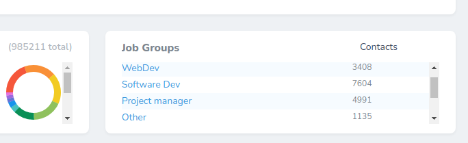

# Nova List Card

[](https://github.com/yaroslawww/nova-list-card/blob/master/LICENSE.md)
[](https://packagist.org/packages/yaroslawww/nova-list-card)
[](https://packagist.org/packages/yaroslawww/nova-list-card)
[](https://scrutinizer-ci.com/g/yaroslawww/nova-list-card/build-status/master)
[](https://scrutinizer-ci.com/g/yaroslawww/nova-list-card/?branch=master)
[](https://scrutinizer-ci.com/g/yaroslawww/nova-list-card/?branch=master)

| Nova  | Package |
|-------|---------|
| V1-V3 | V1-V3   |
| V4    | V4      |

### Install

```bash
composer require yaroslawww/nova-list-card
```

### Usage

```php
<?php
namespace App\Nova\Metrics;

use NovaListCard\ListCard;

class ContactsPerJobGroup extends ListCard {

    public function __construct( $component = null ) {
        parent::__construct( $component );

        $this->resource( \App\Nova\Resources\JobGroup::class )
             ->heading( $this->name(), 'Contacts' )
             ->withCount( 'contacts' )
             ->orderBy( 'contacts_count', 'desc' )
             ->limit( 100 )
             ->zebra()
             ->value( 'contacts_count' );
    }

    public function cacheFor() {
        return now()->addMinutes( 10 );
    }

    public function uriKey() {
        return 'contacts-per-job-groups';
    }

    public function name() {
        return 'Job Groups';
    }
}
```


