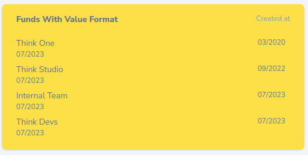

# Nova List Card


[](https://packagist.org/packages/think.studio/nova-list-card)
[](https://packagist.org/packages/think.studio/nova-list-card)
[](https://scrutinizer-ci.com/g/dev-think-one/nova-list-card/build-status/main)
[](https://scrutinizer-ci.com/g/dev-think-one/nova-list-card/?branch=main)
[](https://scrutinizer-ci.com/g/dev-think-one/nova-list-card/?branch=main)


| Nova  | Package |
|-------|---------|
| V1-V3 | V1-V3   |
| V4    | V4      |

### Install

```bash
composer require think.studio/nova-list-card
```

### Usage


```php
class FundsWithReportsCount extends ListCard
{
    public function __construct($component = null)
    {
        parent::__construct($component);

        $this->resource(\App\Nova\Resources\Fund::class)
            ->heading($this->name(), 'Reports')
            ->withCount('reports')
            ->orderBy('reports_count', 'desc')
            ->limit(100)
            ->value('reports_count');
    }

    public function cacheFor(): int|Carbon
    {
        return Carbon::now()->addMinutes(2);
    }
}
```


```php
class FundsWithReportIncomeSum extends ListCard
{
    public function __construct($component = null)
    {
        parent::__construct($component);

        $this->resource(\App\Nova\Resources\Fund::class)
            ->heading($this->name(), 'Total Income')
            ->withSum('reports', 'income')
            ->orderBy('reports_sum_income', 'desc')
            ->limit(100)
            ->value('reports_sum_income');
    }
}
```


```php
class FundsCustomList extends ListCard
{

    public function __construct($component = null)
    {
        parent::__construct($component);

        $this->resource(\App\Nova\Resources\Fund::class)
            ->heading($this->name())
            ->limit(100)
            ->timestamp('updated_at', 'm/Y')
            ->queryCallback(fn (Builder $q) => $q->where('publication_status', 'draft'));
    }

    public function name(): string
    {
        return 'Draft funds';
    }
}
```



```php
class FundsWithValueFormat extends ListCard
{
    public function __construct($component = null)
    {
        parent::__construct($component);

        $this->resource(\App\Nova\Resources\Fund::class)
            ->heading($this->name(), 'Created at')
            ->limit(100)
            ->timestamp('updated_at', 'm/Y')
            ->value('created_at', 'datetime', 'm/Y')
            ->classes('bg-yellow-300')
            ->noMaxHeight();
    }
}
```

## Credits

- [](https://think.studio/)
